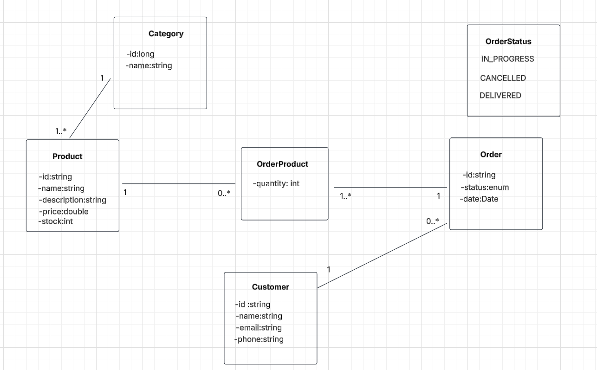
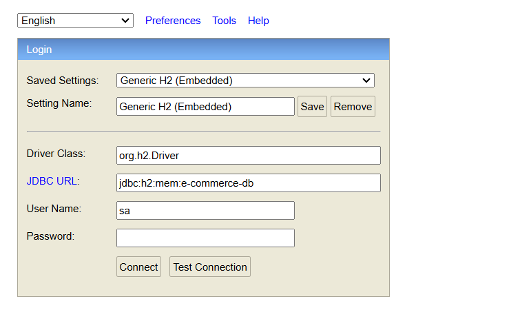
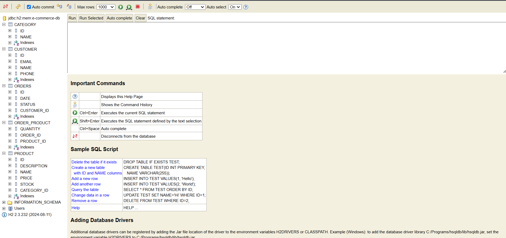
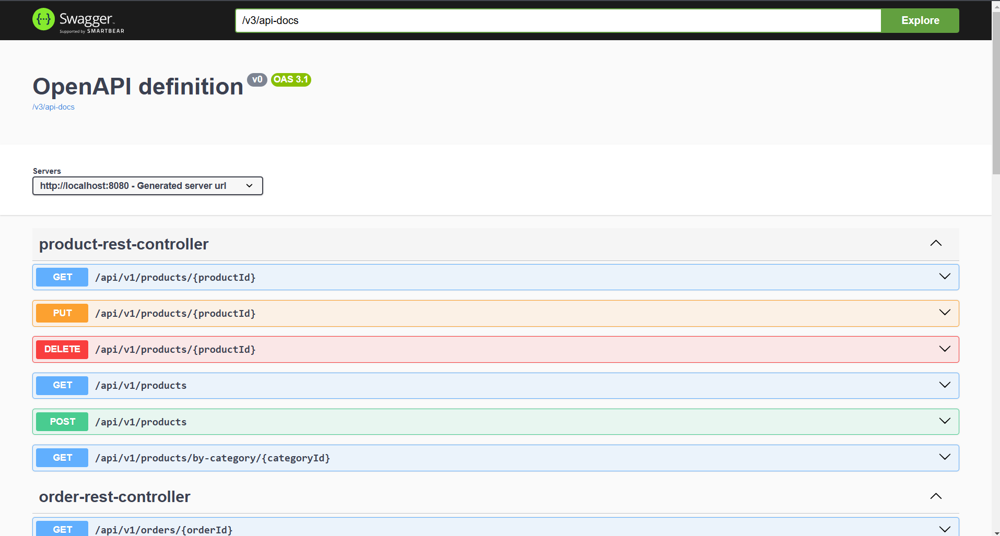
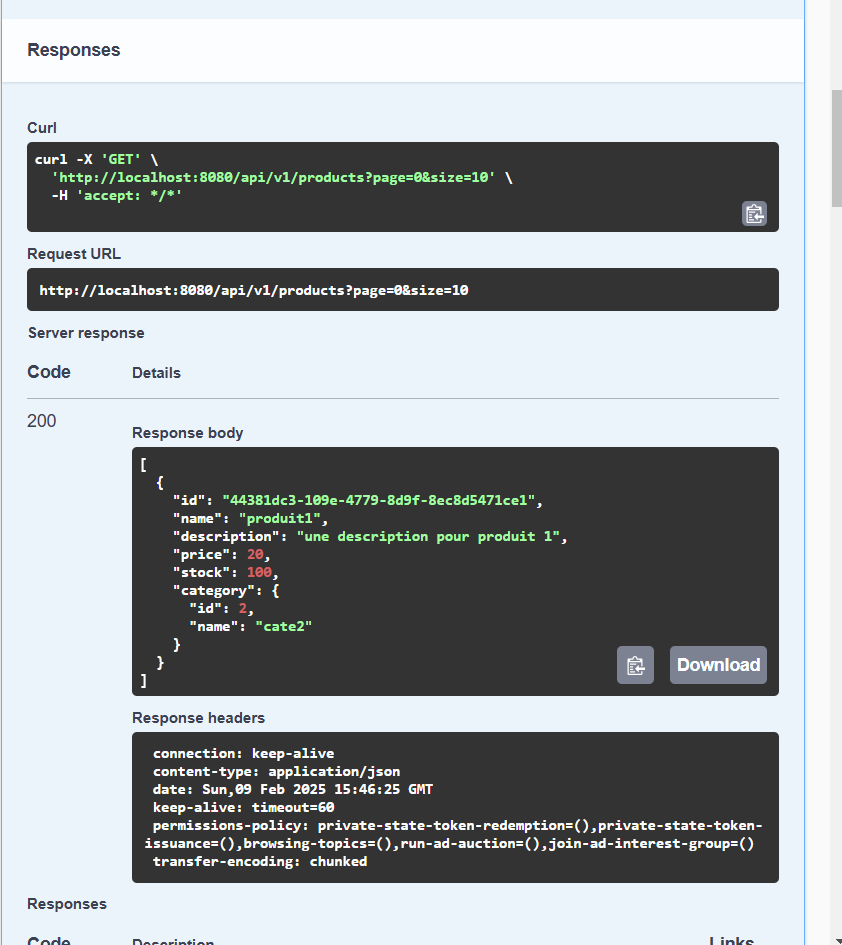

# e-commerce-example-rest-api
un exemple d'une api rest d'une application e-commerce minimal avec les entités Product,Category,Customer,Order.
# le diagramme de classes implémenté dans ce projet


## les dépendances du projet
- Spring Web :pour la création d'une Api Rest
- Spring Data Jpa :pour la couche accés aux données.
- H2 Database: une base de données pour le test
- Lombok: pour la génération automatique des getters,setters,constructeurs,le design pattern Builder.
- Validation: pour la validation des données entrantes à l'application (ie les dtos)
- Ehcache: pour le cache et l'optimisation de la performance de l'application.
 ## Toutes les dépendances 
```sh
  <dependency>
    <groupId>org.springframework.boot</groupId>
    <artifactId>spring-boot-starter-data-jpa</artifactId>
  </dependency>
  <dependency>
    <groupId>org.springframework.boot</groupId>
    <artifactId>spring-boot-starter-web</artifactId>
  </dependency>
  <dependency>
    <groupId>org.springframework.boot</groupId>
    <artifactId>spring-boot-starter-validation</artifactId>
  </dependency>
  <dependency>
    <groupId>com.h2database</groupId>
    <artifactId>h2</artifactId>
    <scope>runtime</scope>
  </dependency>
  <dependency>
    <groupId>org.springdoc</groupId>
    <artifactId>springdoc-openapi-starter-webmvc-ui</artifactId>
    <version>2.8.4</version>
  </dependency>
  <dependency>
    <groupId>org.ehcache</groupId>
    <artifactId>ehcache</artifactId>
    <version>3.8.1</version>
  </dependency>
  <dependency>
    <groupId>org.projectlombok</groupId>
    <artifactId>lombok</artifactId>
    <optional>true</optional>
  </dependency>
```
## application.properties
la base de données est de type H2 in-memory qui s'écrase à chaque fois l'application démarre c'est trés utile dans la phase de développement.

```sh
    spring.application.name=e-commerce
    spring.h2.console.enabled=true
    spring.datasource.url=jdbc:h2:mem:e-commerce-db
    spring.jpa.show-sql=true
    spring.jpa.properties.hibernate.format_sql=true
    spring.jpa.hibernate.ddl-auto=update
    spring.cache.jcache.config=classpath:ehcache.xml
```
## le fichier ehcache.xml pour la configuration du cache
```xml
<?xml version="1.0" encoding="UTF-8"?>
<config xmlns:xsi='http://www.w3.org/2001/XMLSchema-instance'
        xmlns='http://www.ehcache.org/v3'
        xmlns:jsr107='http://www.ehcache.org/v3/jsr107'>

    <cache alias="myCache">
        <key-type>java.lang.String</key-type>
        <value-type>java.lang.String</value-type>
        <expiry>
            <ttl unit="minutes">30</ttl>
        </expiry>
        <resources>
            <heap unit="entries">100</heap>
        </resources>
    </cache>

</config>
```

# Consultation de la base de données créée
entrer ce lien
```http request
   http://localhost:8080/h2-console
```


cliquer sur **connect**,la page qui suit va être afficher



## ajouter une catégorie
* POST: http://localhost:8080/api/v1/categories
* body: 
```json
    {
      "name": "categorie 1"
    }
```
* réponse
```json
    {
      "id": 1,
      "name": "categorie 1"
    }
```
## liste des catégories
* GET: http://localhost:8080/api/v1/categories
* réponse
```json
   [
      {
        "id": 1,
        "name": "categorie 1"
      },
      {
        "id": 2,
        "name": "categorie 2"
      }
  ]
```

## supprimer une catégorie
* DELETE: http://localhost:8080/api/v1/categories/{categoryId}
* variable de path: categoryId :long
* réponse (succés)
```text
   Category deleted successfully
```
* échec (categoryId n'existe pas)
```json
    {
      "message": "Category not found",
      "code": 404,
      "timestamp": "2025-02-09T15:30:11.1271951"
    }
```

## mise à jour une categorie
* PUT: http://localhost:8080/api/v1/categories/{categoryId}
* variable de path: categoryId :long
* réponse (succés)
```json
   {
      "id": 2,
      "name": "cate2"
    }   
```
* échec (categoryId n'existe pas)
```json
    {
      "message": "Category not found",
      "code": 404,
      "timestamp": "2025-02-09T15:33:28.6815476"
    }
```
## lire une categorie
* GET: http://localhost:8080/api/v1/categories/{categoryId}
* variable de path: categoryId :long
* réponse (succés)
```json
   {
      "id": 2,
      "name": "cate2"
   }
```
* échec (categoryId n'existe pas)
```json
    {
      "message": "Category not found",
      "code": 404,
      "timestamp": "2025-02-09T15:34:45.2652635"
    }
```

## ajouter un produit
* POST: http://localhost:8080/api/v1/products
* body:
```json
     {
      "name": "produit1",
      "description": "une description pour produit 1",
      "price": 20,
      "stock": 100,
      "categoryId": 2
     }
```
* réponse (succés)
```json
   {
      "id": "44381dc3-109e-4779-8d9f-8ec8d5471ce1",
      "name": "produit1",
      "description": "une description pour produit 1",
      "price": 20,
      "stock": 100,
      "category": {
        "id": 2,
        "name": "cate2"
      }
   }
```
* échec (categoryId n'existe pas)
```json
    {
      "message": "Category not found",
      "code": 404,
      "timestamp": "2025-02-09T15:37:43.3019193"
    }
```
## liste des produits
* GET: http://localhost:8080/api/v1/products?page=0&size=10
* paramêtres optionels de la requêtes:page:int (0 par défaut) & size:int (10 par défaut) pour ne pas extaire toute la liste des produits d'un seul coup ce qui améliore la performance
* réponse (succés)
```json
   [
      {
        "id": "44381dc3-109e-4779-8d9f-8ec8d5471ce1",
        "name": "produit1",
        "description": "une description pour produit 1",
        "price": 20,
        "stock": 100,
        "category": {
          "id": 2,
          "name": "cate2"
        }
      }
]
```
# de même pour les autres endpoints

# Documentation swagger
il existe une dépendance qui permet de documenter les endpoints de l'application avec la possibilité d'intéragir avec l'API Rest d'une manière simple
```shell
  <dependency>
    <groupId>org.springdoc</groupId>
    <artifactId>springdoc-openapi-starter-webmvc-ui</artifactId>
    <version>2.8.4</version>
  </dependency>
```
pour afficher la documentation SWAGGER,il suffit d'entrer le lein suivant

```http request
   http://localhost:8080/swagger-ui.html
```
### cette documentation est largement utilisée dans spring boot et qui permet la collaboration entre les équipes,pour chaque endpoint,elle indique quelle est la méthode HTTP,les paramètes de la requête,le corps de la requête,le result d'exécution de la requête,elle prend en charge aussi la validation.

# Vue générale de cette documentation



# exemple (liste des produits)



# Cache
Spring met en cache des données pour améliorer les performances et réduire les appels redondants  a la base de données Il utilise l’annotation @Cacheable pour stocker les résultats, @CachePut pour mettre à jour la cache, et @CacheEvict pour la vider. Par défaut, Spring supporte plusieurs fournisseurs comme EhCache, Redis ou Caffeine.
dans ce projet j'ai utilisé **Ehcache**.